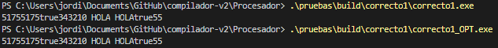
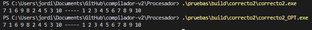
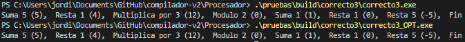
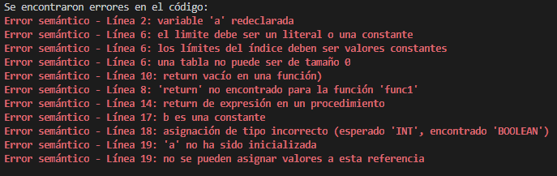
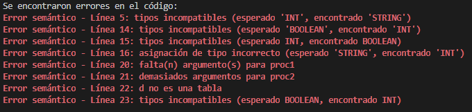
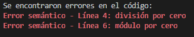
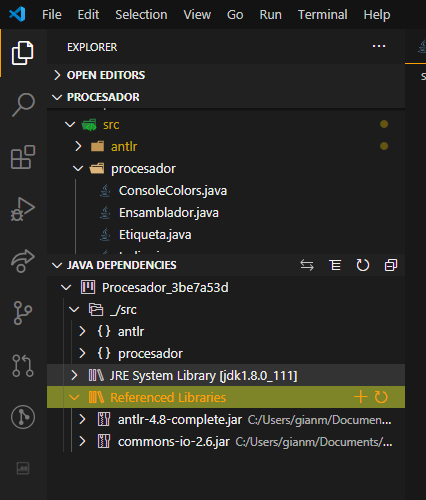
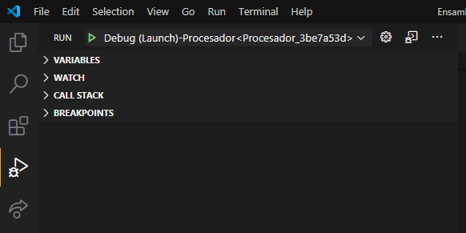
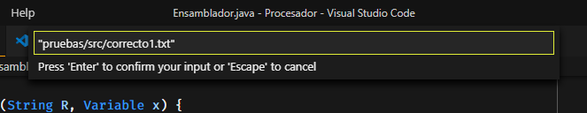

# Compilador: *front-end* y *back-end*
El proyecto consiste en el desarrollo de la parte *back-end* de un procesador para un lenguaje de programación. Las tareas que tiene que realizar el procesador son las de generación de código intermedio, optimización y generación de código ensamblador.

# Lenguaje
Nuestro lenguaje tiene el nombre de Vaja y es una versión simplificada de Java con elementos propios de lenguajes como C o Python que tiene las siguientes características:

##	Tipos de datos
- **Entero**. El conjunto de números enteros en formato decimal.
- **String**. Cadena de caracteres básica. En este lenguaje se hace de manera similar a Java, no exactamente porque no son objetos, en vez de C, porque en C se implementan como arrays de caracteres. 
- **Boolean**. Dato lógico que puede representar únicamente dos valores, cierto o falso.
- **Tablas** (Arrays). Agrupación de variables de un tipo en concreto (entero, string o boolean) que puede ser de varias dimensiones de tamaño.

## Operaciones
- Operaciones aritméticas
  - **Negación**: `a = -b`
  - **Multiplicación**: `a = b * c`
  - **División**: `a = b / c`
  - **Módulo**: `a = b % c`
  - **Suma**: `a = b + c`
  - **Resta**: `a = b – c`
- Operaciones lógicas
  - **Not**: `a = !b`
  - **And**: `a = b && c`
  - **Or**: `a = b || c`
- Operaciones relacionales:
  - **Igual**: `a == b`
  - **Diferente**: `a != b`
  - **Mayor**: `a > b`
  - **Menor**: `a < b`
  - **Mayor o igual**: `a >= b`
  - **Menor o igual**: `a <= b`
- Operaciones de entrada y salida. Todas estas operaciones se realizan por consola.
  - `proc printi(int i)`. Para imprimir integers positivos y negativos.
  - `proc prints(string s)`. Para imprimir strings.
  - `proc printb(boolean b)`. Para imprimir booleans.
  - `func string read()`. Para leer el input de teclado del usuario. Devuelve como valor de la función el string con el input leído.
- Asignación: `a = b`
- Estructura condicional
  - `if {...}`. Estructura básica en la que se comprueba el valor de una expresión lógica y si se cumple, se ejecutan las sentencias que están dentro.
  - `if {...} else {...}`. Estructura en la que se comprueba el valor de una expresión lógica y si se cumple, se ejecutan las sentencias que están dentro del if. Y si no, se ejecutan las del else.
  - `switch { case expr: ... [break;] [default: ...]}`. Estructura en la que se evalúa una expresión numérica (entero) y se ejecutan las sentencias del caso asignado a la misma. Los casos pueden ser expresiones y no solamente literales. Se puede definir un caso por defecto que se ejecutará siempre que no se cumpla alguno del resto de los casos con la directiva default. Esta directiva tiene que ser la última del switch. Al final de las sentencias de cada caso (menos el default) se puede indicar con la directiva break; si se quiere terminal el switch o se quiere seguir ejecutando las sentencias del caso siguiente.
- Estructura iterativa
  - `while {...}`. Estructura en la que se comprueba en cada iteración si se cumple una condición y, si se cumple, se ejecutan sus sentencias.
- Llamada a método. Si se está haciendo una llamada a un procedimiento, simplemente se ejecuta su código. Si se trata de una función, además se puede usar su valor de retorno como parte de una expresión.
- `return`. En los procedimientos se puede usar el return para salirse de la ejecución antes de que se ejecuten el resto de las sentencias. En ese caso el return no tiene ningún valor asociado y solo termina la ejecución de la subrutina. Si es una función, es obligatorio que tenga asociado un valor del mismo tipo que la función. Este valor se devolverá como resultado de la función.

## Detalles
Como detalles a destacar del lenguaje tenemos los siguientes:
- Se pueden definir variables y constantes dentro de funciones, procedimientos, estructuras condicionales e iterativas.
- Se pueden definir funciones y procedimientos dentro de funciones y procedimientos.
- La estructura de los programas, subprogramas y sentencias complejas (if, if else y while) tiene que ser esta:
  1. *Declaraciones*. Puede no haber ninguna declaración.
  2. *Sentencias*. Tiene que haber como mínimo una.
- Se pueden hacer returns a mitad de función o a mitad de procedimiento. En el caso del procedimiento tiene que ser un return vacío que no devuelva ninguna expresión.
- Se pueden declarar y utilizar tablas. Estas tablas o arrays se pueden definir con varias dimensiones. Para cada dimensión se debe indicar o su tamaño, o sus límites inferior y superior. Estos valores tienen que ser conocidos en tiempo de compilación, por lo tanto, tienen que ser literales o constantes de tipo integer.
- No es necesario un subprograma main. Lo que está fuera de subrutinas se ejecutará, de manera similar a los programas escritos en Python. 
- Una particularidad de nuestro lenguaje es que las declaraciones deben ir antes de las sentencias.

# Generación de código intermedio
En primer lugar, el compilador realiza un análisis del código en el que busca errores léxicos, sintácticos y semánticos.  Si detecta un error léxico o sintáctico deja de ejecutarse. Si detecta un error semántico sigue evaluando el resto del programa para encontrar el resto de los errores. Esto se hace desde el código generado por ANTLR a partir de la gramática y las acciones semánticas que hemos definido en el archivo `Procesador/grammar/vaja.g4`.

En el caso en el que no se haya detectado ningún error se procede a la generación de código intermedio. Para esta tarea hemos decidido implementar otro archivo (`Procesador/grammar/vajaC3D.g4`) que acepta la misma gramática que el otro, pero que además se encarga de generar el código de tres direcciones asociado a cada producción. Hemos decidido hacerlo de esta manera, es decir, haciendo dos pasadas sobre el código y usando dos archivos de gramática distintos, porque simplifica mucho la tarea de comprobación de que el código fuente es correcto antes de generar el código intermedio. Para que este proceso sea más eficiente, el código generado se guarda en memoria hasta que se ha leído todo el código fuente y generado el código intermedio por completo, que es cuando se guarda en un archivo.

## Evaluación de expresiones booleanas

Un componente que hemos incluido y que pensamos que es importante destacar es la llamada “evaluación corta” de expresiones booleanas. En concreto, hemos seguido el planteamiento del modelo de incorporación retroactiva de etiquetas o backpatching. Este tipo de evaluación hace que no sea necesario comprobar todos los elementos que conforman una expresión lógica. Si ya se conoce de con seguridad el valor final de la expresión se salta lo que no sea necesario evaluar.

# Optimización de código

Para la optimización de código de 3 direcciones se ha creado una clase llamada Optimizador.java donde se recogen todas las optimizaciones de código creadas para esta práctica. Todas las optimizaciones se ejecutan en una copia de la lista de instrucciones de 3 direcciones sin optimizar que salen de la generación de código intermedio. Además, también se crean copias de las tablas de variables, de procedimientos y de etiquetas, y se actualizan conforme se ejecutan las optimizaciones.

Las optimizaciones realizadas (en este orden) son:
- **Optimización de asignaciones de booleanos**. Se aplica la optimización definida en los apuntes de la asignatura, donde se sustituye la compleja asignación entre booleanos por una asignación simple.
- **Eliminación de código en un if con valores constantes**. Se aplica la optimización definida en los apuntes de la asignatura, donde, cuando se puede saber el valor del condicional de un if en tiempo de compilación, se reducen las expresiones al valor que sale del condicional, y desaparece el if.
- **Optimización de un if negando la condición**. Se aplica la optimización definida en los apuntes de la asignatura, donde se niega la condición de un if, reduciendo el número de etiquetas necesarias para producir el código de 3 direcciones.
- **Eliminación de etiquetas innecesarias**. Se eliminan todas las etiquetas generadas que no tengan un goto o procedimiento asociado.
- **Eliminación de código, si es inaccesible, entre un goto y su skip**. Se elimina el código entre un goto, incluido, y su skip, no incluido, si no hay un skip con otra etiqueta dentro. Después se vuelve a ejecutar la función anterior para quitar todos los skips que se hayan quedado sin goto y no tengan otro goto en el código.
- **Optimización de asignaciones de variables temporales y eliminación de las innecesarias**. Se reduce el código generado por variables temporales al hacer asignaciones de los literales que se copian en ellas directamente, comprobando que no se necesitarán en ningún otro sitio. También se hace para operaciones aritméticas y elimina asignaciones repetidas contiguas que surgen al aplicar las optimizaciones.

Después de las optimizaciones, se vuelven a recalcular las líneas donde se encuentran las etiquetas y también la ocupación de las variables locales, además del desplazamiento de las variables locales y parámetros de los subprogramas.

# Generación de código ensamblador

Nuestro programa genera código ensamblador x86 con la sintaxis de MASM (Microsoft Macro Assembler) y genera ejecutables que utilizan la API de 32 bits de Windows (Win32) para las tareas relacionadas con el input y output de información, entre otras.

El proceso de generación de código ensamblador tiene varias secciones:

## Preámbulo

En esta parte se incluyen las librerías necesarias para el funcionamiento de los programas. También se declara el instruction set que se usa (`.386`), el modelo de memoria (`.model flat, stdcall`) que usará el ejecutable y detalles como que las etiquetas distinguen mayúsculas y minúsculas (`option casemap:none`).

## Datos

Aquí se declaran los diferentes tipos de datos que están presentes en el código fuente (sin incluir las variables locales y los parámetros, que funcionan de otra manera distinta). Dependiendo de su tipo (constante o variable) y tipo subyacente (entero, boolean o string), además del hecho de si son o no tablas, se declararán de forma distinta.

## Constantes

Primero está la sección `.const`. En esta sección es donde se declaran todas las constantes de tipo integer y boolean que se definen en el código, sin importar si son locales o globales, ya que el proceso de análisis del código ya se ha encargado de determinar que el ámbito en el que se usa cada referencia es el correcto. Aquí no se definen las constantes de tipo string porque el estándar en MASM es declararlas en la sección de datos inicializados.

## Datos inicializados

En la sección `.data` es donde se declaran los strings constantes que aparecen en el programa, ya sean realmente constantes definidas por el usuario o literales de tipo string. El motivo es que los strings de nuestros programas funcionan únicamente como punteros a posiciones de memoria. Una variable string solo tiene dos posibles orígenes de los que conseguir su valor, y estos son los literales (y también constantes) o el input del usuario, del que hablaremos después en la sección de subrutinas del sistema. Por lo tanto se puede hacer que las variables de tipo string contengan únicamente la dirección de memoria a la cadena de caracteres. Esto simplifica la gestión de los strings, ya que todas las variables de tipo string tienen la misma ocupación en memoria (4 bytes) pero pueden tener un tamaño distinto, e incluso cambiar de tamaño. En esta sección también se declara una variable de 4 bytes de tamaño que servirá para la gestión del input de usuario (`inputPtr`). Todo lo definido en esta sección se añadirá al tamaño final del ejecutable, ya que es información que se conoce antes de ejecutar el programa.

## Datos no inicializados

En la sección `.data?` se encuentran las variables globales del programa. Sin importar su tipo subyacente, aquí se reserva sus espacio en memoria y se le asigna una etiqueta, que es el identificador usado en el código fuente. Para las tablas se reserva la ocupación de cada celda multiplicada por la cantidad de celdas que las conforman. También se definen en esta sección el buffer que se utiliza para almacenar el input de los usuarios, `inputBuffer`, y el display vector,` DISP`, que sirve para mantener un registro de las llamadas a subrutinas y la información involucrada en cada nivel de profundidad. Los datos definidos en esta sección no afectan al tamaño final del ejecutable, únicamente se reflejan en la memoria que puede llegar a necesitar el programa a la hora de ejecutarse. Esto es porque no se asigna ningún valor a la posición de memoria. Las variables globales que si son inicializadas en el programa original escrito por el usuario se inicializan con una asignación en el mismo orden en el que se hace en el código original.

## Programa principal

A esta sección se le asigna la etiqueta `start` y se define como un subprograma. Esto se hace por convención de MASM, porque así es como se determina cuál es el punto de entrada del programa. Para señalizar que esa etiqueta es el punto de entrada se marca al final del programa con `END start`. Aquí es donde se incluyen todas las sentencias que están fuera de subrutinas definidas por el usuario.

## Subrutinas del sistema

Aquí es donde se definen las subrutinas de input y output que proporciona el lenguaje. Además también se definen las subrutinas necesarias para el funcionamiento de estas.

### Input

El funcionamiento de esta subrutina llamada `read` se basa en la llamada del sistema `StdIn`, que tiene como parámetros el tamaño del buffer de lectura y la dirección de memoria en la que se guardará la información. El buffer que se usa es de 254 bytes porque es el máximo tamaño con el que se puede operar, ya que tiene que haber espacio para el salto de línea que lo termina y para el byte que marca el fin del string. La manera en la que se almacena el resultado de la lectura por teclado es guardando la información en el buffer inputBuffer desde la posición indicada por `inputPtr` y devolviendo la dirección del inicio del string. Para que no se sobreescriba la información leída, se mueve el puntero `inputPtr` al final del string que se acaba de leer. Para realizar esta operación se utiliza una subrutina que calcula la longitud de un string (`strlen`). Si la posición de memoria a la que apunta se sale del buffer definido, se vuelve a apuntar al inicio del buffer y se comenzará a sobreescribir la información leída. Esto realmente no es un problema ya que gracias al principio de localidad, las variables que se inicializan a un valor se suelen usar inmediatamente después. En cualquier caso, se pueden llegar a almacenar como mínimo 256 strings de tamaño máximo que provengan del input de teclado.

### Output

El funcionamiento de las tres subrutinas (`printi`, `printb` y `prints`) se basa en la llamada del sistema `StdOut`, que tiene como único parámetro la dirección del string a imprimir por pantalla. Para la subrutina `prints`, que imprime un string, la operación es prácticamente directa, ya que solo hay que pasar los parámetros a `StdOut`. Para printi y para `printb` , que imprimen un integer y un boolean respectivamente, hay que realizar una conversión a string. Para el caso de los integers se usa una subrutina llamada `EAX_to_DEC`, que convierte un integer a un string. El procedimiento printi funciona también con números negativos. Para printb lo que se hace es imprimir `true` si es cierto y `false` si es falso.

## Subrutinas definidas por el usuario

Se definen las subrutinas que los usuarios han creado en el código original poniendo como etiqueta de inicio el identificador del subprograma acompañado del número de procedimiento (en lugar de únicamente el número de procedimiento) para que se vea más claro a qué subrutina se está llamando. En nuestro lenguaje se pueden definir funciones y procedimientos locales, es decir, que solamente son visibles en el ámbito de la propia función o procedimiento en el que se definen. Sin embargo, a la hora de declararlos en el código ensamblador generado hemos decidido definirlos de manera independiente. Esto no afecta al control del ámbito en el que se usan las referencias ya que eso ya se ha verificado en el análisis del programa en las fases anteriores de la compilación.

# Ficheros generados

Cuando se compila un archivo, se crea una carpeta con su nombre de esta manera: `Procesador/pruebas/build/{prueba}`, siendo prueba el nombre del archivo. Para una prueba correcta se generan los siguientes archivos:
- `{prueba}.asm`. El archivo que contiene el código ensamblador generado a partir del código intermedio sin optimizar.
- `{prueba}.exe`. El ejecutable que produce el resultado de ejecutar el código ensamblador a partir del código C3D sin optimizar.
- `{prueba}.obj`. Archivo intermedio que crea el comando ml que usa el linker para generar el archivo con las instrucciones que salen del código C3D sin optimizar.
- `{prueba}_C3D.txt`. Archivo con el código intermedio sin optimizar generado después de ejecutarlo en el compilador de ANTLR
- `{prueba}_OPT.asm`. El archivo que contiene el código ensamblador generado a partir del código intermedio optimizado.
- `{prueba}_OPT.exe`. El ejecutable que produce el resultado de ejecutar el código ensamblador a partir del código C3D optimizado.
- `{prueba}_OPT.obj`. Archivo intermedio que crea el comando ml que usa el linker para generar el archivo con las instrucciones que salen del código C3D optimizado.
- `{prueba}_C3D_OPT.txt`. Archivo con el código intermedio optimizado generado después de ejecutarlo en el compilador de ANTLR
- tablaprocedimientos.html. Tabla en formato HTML que contiene todos los procedimientos, los mismos tanto en el código C3D sin optimizar como en el optimizado.
- `tablasimbolos.html`. Tabla en formato HTML que contiene todos los símbolos.
- `tablavariables.html`. Tabla en formato HTML que contiene todas las variables del código sin optimizar
- `tablavariables_OPT.html`. Tabla en formato HTML que contiene todas las variables del código una vez optimizado, sin contar las que se han borrado.
- `tokens.txt`. Contiene todos los tokens generados para el código en concreto.

Para las pruebas incorrectas se generan estos archivos:

- `errores.txt`. Contiene la lista de errores generados por el código incorrecto
- `tablasimbolos.html`. Tabla en formato HTML que contiene todos los símbolos.
- `tokens.txt`. Contiene todos los tokens generados para el código en concreto.

# Programas de prueba

Las pruebas diseñadas para demostrar el correcto funcionamiento del compilador, ya sea a la hora de generar un ejecutable o a la hora de detectar errores de programación, se encuentran en el directorio `Procesador/pruebas/src/`.

## Correctos

### Correcto1

En este ejemplo se ha decidido poner código para comprobar, en la medida de lo posible, que el código optimizado genera el mismo output que el código sin optimizar. Por ello, el código en sí no tiene mucho sentido, e importa más que lo que genera este en el mismo orden.

El código de la prueba:
```
int a=3;
const string s1 = "Hola mundo";
const int asdf=32;
const boolean VERDAD=true;
string s2 = s1;
int c=a;
boolean par = VERDAD && (false || true);
func boolean function1(string str, int i, boolean foo){
	int a = 2;
	boolean b;
	string straux = "HOLA";
	proc prueba(){
		int asdf=89;
		printi(5);
	}
	a = 5;
	b=foo;
	while(a>0){
		b = par;
		par=false;
		a = a-1;
		printi(a);
	}
	prints(" ");
	prints(straux);
	prints(" ");
	prints(str);
	foo = true;
	return foo;
}

func int funcion2() {
	return 55;
}

proc main(){
	printi(c);
}
int z = 2+10;
int y = 0;
if(6>5){
	boolean b;
	a=78;
	z=z/8+z+89*58;
	printi(z);
}
printi(z);
printb(par);
main();
par = function1("HOLA",89,true);
y = funcion2();
printb(par);
printi(y);
```
El output que da al ejecutarlo es:



### Correcto2

En este ejemplo se ha decidido hacer un programa para ordenar un array. Después se hace un print del valor que tiene sin ordenar y luego el ordenado.

El código de la prueba:

```
int x = 10;
int a[10];
int d = 0;


proc ordenarArray(){
	int i = 0;
	int j;
	int min_idx;
	int temp;

	while(i< x - 1){
		min_idx = i;
		j = i + 1;
		while(j<x){
			if(a[j]<a[min_idx]){
				min_idx = j;
			}
			j = j + 1;
		}
		temp = a[min_idx];
		a[min_idx] = a[i];
		a[i] = temp;
		i = i + 1;
	}
}

a[0] = 7;
a[1] = 1;
a[2] = 6;
a[3] = 9;
a[4] = 8;
a[5] = 2;
a[6] = 4;
a[7] = 5;
a[8] = 3;
a[9] = 10;

while(d<10) {
	printi(a[d]);
	prints(" ");
	d = d + 1;
}
prints("----- ");
ordenarArray();

d = 0;
while(d<10) {
	printi(a[d]);
	prints(" ");
	d = d + 1;
}
```

El output que da al ejecutarlo es:



### Correcto3

En este ejemplo se busca probar el funcionamiento de los switch, donde se usarán para ir cambiando un int en función de las opciones marcadas. Para ello, se ha creado un array de ints con las opciones a ejecutar.

El código de la prueba:

```
/*Esto es un comentario*/

int x = 0;
int i = 0;
int a[10];
boolean b = false;


proc calculo(){
	switch(a[i]){
		case 1:
			x = x + 1;
			printi(x);
			prints("),  ");
			break;
		case 2:
			x = x + 5;
			printi(x);
			prints("),  ");
			break;
		case 3:
			x = x - 1;
			printi(x);
			prints("),  ");
			break;
		case 4:
			x = x - 5;
			printi(x);
			prints("),  ");
			break;
		case 5:
			x = x * 3;
			printi(x);
			prints("),  ");
			break;
		case 6:
			x = x % 2;
			printi(x);
			prints("),  ");
			break;
		case 7:
			prints("Fin");
			break;
	}	
}

a[0] = 2;
a[1] = 3;
a[2] = 5;
a[3] = 6;
a[4] = 1;
a[5] = 3;
a[6] = 4;
a[7] = 7;
a[8] = 1;
a[9] = 3;

while(!b){
	switch(a[i]){
		case 1:
			prints("Suma 1 (");
			break;
		case 2:
			prints("Suma 5 (");
			break;
		case 3:
			prints("Resta 1 (");
			break;
		case 4:
			prints("Resta 5 (");
			break;
		case 5:
			prints("Multiplica por 3 (");
			break;
		case 6:
			prints("Modulo 2 (");
			break;
		case 7:
			b = true;
			break;
		default:
			prints(" (No existe esa opción.) ");
	}
	calculo();
	i = i + 1;
}
```
El output que da al ejecutarlo es:



## Incorrectos

En los incorrectos se ha optado por añadir los errores semánticos, al ser los que tienen más variedad, y se han juntado los más importantes en los dos primeros archivos, dejando el tercero para un error específico, la división por 0.

### Incorrecto1

El código de la prueba:

```
int a;
int a;
const int b = 3;
int d = 5;
boolean e = true;
int f[a];

func int func1(){
    int a = 5;
    return;
}
proc proc1(){
    int a = 5;
    return a;
}

b = d;
d = e;
f = a;
func1();
```
El output de errores que da al compilar es:



### Incorrecto2

El código de la prueba:

```
int a = 2;
boolean b = false;
string c;
int d = 3;
int f = "10";

proc proc1(int e){
    a = d;
}
proc proc2(){
    c = "Hola";
}

if(a){
    if(b<3){
        c = a;
    }
}

proc1();
proc2(d);
d[2] = 5;
d = b + a;
```
El output de errores que da al compilar es:



### Incorrecto3

El código de la prueba:

```
int a = 10;
int c;

c = a/0;
c = a%0;
```

El output de errores que da al compilar es:



# Instalación

Como hemos dicho antes, el entorno en el que hemos desarrollado este proyecto está basado en Visual Studio Code. También será necesario instalar las dependencias relacionadas con la generación de archivos de java a partir de la gramática; las relacionadas con el ensamblado y enlazado de los archivos de código ensamblador; y también las librerías externas que usa el proyecto. Estos son los pasos a realizar:

1.	Instalar el editor de código Visual Studio Code desde la [página oficial](https://code.visualstudio.com/).
2.	Instalar el paquete de extensiones Java Extension Pack desde su [página](https://marketplace.visualstudio.com/items?itemName=vscjava.vscode-java-pack) en el marketplace de Visual Studio Code. Este paquete de extensiones añade la capacidad de ejecutar el proyecto desde la terminal del editor.
3.	Comprobar que las librerías externas se han importado de forma correcta. Esto se puede verificar desde el panel `Explorer/Java Dependencies/Referenced Libraries` (para que aparezca este panel se tiene que abrir un archivo .java y se activen las extensiones), en este tienen que aparecer las dos librerías externas que se importan en el proyecto:

    
    
    > Estas dos librerías están en la carpeta `/lib`, dentro de la carpeta del proyecto de java. Si no se incluyen correctamente hay que hacerlo de forma manual, dándole al botón `+` en el panel de `Referenced Libraries` y añadir de manera individual los dos archivos.
4.	Configurar la ejecución del proyecto desde el archivo launch.json. Para hacer esto hay que crear uno nuevo, que VS Code ya completará por defecto, y añadirle que pida al usuario los argumentos del programa, que en este caso será la dirección del archivo de código fuente que se quiera compilar. Para que VS Code cree el archivo hay que abrir el panel de comandos con el atajo de teclado `Ctrl+Shift+P`, y luego escribir launch.json. Hay que seleccionar la opción que dice Open launch.json. Hay que añadir la configuración `"args": "${command:SpecifyProgramArgs}"`.
5.	Instalar MASM32 SDK (entorno de desarrollo para Microsoft Macro Assembler) desde la [página oficial](http://www.masm32.com/download.htm). Hay que seleccionar un servidor desde el que realizar la descarga, en nuestro caso elegimos “US Site 1”. Después de realizar la descarga hay que seguir el proceso de instalación, que es autoexplicativo y relativamente rápido y sencillo. Es necesario instalarlo en la raíz del sistema en la unidad que contenga el sistema operativo (`C:\masm32`), que en nuestro caso es C, para que los includes del código ensamblador funcionen correctamente.
6.	Añadir la carpeta `/masm32/bin` y `/masm32` al PATH del sistema o del usuario modificando las variables de entorno del sistema. Esto es necesario para que los comandos `ml` y `link` que hacen que se ensamblen y enlacen los programas generados y produzcan ejecutables, respectivamente. Después de añadir esas carpetas al PATH hay que reiniciar Visual Studio Code para que los cambios surjan efecto.

# Ejecución

Para poder ejecutar el proyecto hay que asegurarse que la opción de ejecución seleccionada es la que hemos configurado, aunque es probable que sea la única y por lo tanto ya esté seleccionada. Esto se puede comprobar en el panel “Run”:



Si es la configuración que hemos editado antes no hay que cambiar nada. En el caso contrario hay que abrir el desplegable y seleccionar la correcta.

Para ejecutar el proyecto hay que usar el botón F5, para empezar una sesión de debugging, o el atajo de teclado `Ctrl+F5`, que lanza el programa sin hacer debugging. Se abrirá en la parte superior central de la ventana un campo en el que se podrá escribir los argumentos que usará el programa. Aquí es donde se tiene que escribir la dirección al programa de prueba que se quiera intentar compilar. Esto se hace de esta manera:



En cualquier caso, para que funcione correctamente el programa, se tiene que abrir en Visual Studio Code únicamente la carpeta Procesador, que es la que contiene todo el proyecto, y no abrirlo desde un directorio superior o inferior.
